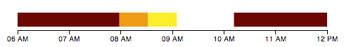

#d3-timeline
A simple d3 timeline plugin.

Get something that looks like


for a dataset that looks like

```js
var testData = [
  {label: "person a", times: [
    {"starting_time": 1355752800000, "ending_time": 1355759900000},
    {"starting_time": 1355767900000, "ending_time": 1355774400000}]},
  {label: "person b", times: [
    {"starting_time": 1355759910000, "ending_time": 1355761900000}]},
  {label: "person c", times: [
    {"starting_time": 1355761910000, "ending_time": 1355763910000}]},
  ];
```

with a call that looks like

```js
var chart = d3.timeline();

var svg = d3.select("#timeline1").append("svg").attr("width", 500)
  .datum(testData).call(chart);
```

Works with circles. In case the rectangular edges are too pointy.


And a pesudo-gantt chart thingy


And icons


For your *really* long charts, it supports scrolling. It can even do things on hover, click, and scroll for when someone accidentially interacts with your chart.

You can also specify an optional `id` key in the data dictionary. This will label each timeline rectangle item within the visualization with the following id property: "timelineItem_"+id. For example, this data

```js
var testData = [
  {id: "pA", label: "person a", times: [
    {"starting_time": 1355752800000, "ending_time": 1355759900000},
    {"starting_time": 1355767900000, "ending_time": 1355774400000}]},
  {id: "pB", label: "person b", times: [
    {"starting_time": 1355759910000, "ending_time": 1355761900000}]},
  {id: "pC", label: "person c", times: [
    {"starting_time": 1355761910000, "ending_time": 1355763910000}]},
  ];
```
would generate `<rect>` with the following ids: `timelineItem_pA`,`timelineItem_pB`,`timelineItem_pC`. This means that you can dynamically change the visual properties of each timeline item using JQuery like so: `$("#timelineItem_pA").css("fill","blue");`.
If no custom id is provided, the id attribute will be generated sequentially in the order they have been provided in. e.g.: `timelineItem_0`.

Look at the [examples](https://github.com/jiahuang/d3-timeline/blob/master/examples/example.html) for more details.

##Data formats

The simplest data format only requires `starting_time` and `ending_time` for each series of data.
```js
[
  {times: [
    {"starting_time": 1355752800000, "ending_time": 1355759900000},
    {"starting_time": 1355767900000, "ending_time": 1355774400000}]},
  {times: [
    {"starting_time": 1355759910000, "ending_time": 1355761900000}]}
];
```

`label` can be added if you want names by each series of data. In order for this to properly show up, the timeline needs to be called with .stack()
```js
[
  {label: "person a", times: [
    {"starting_time": 1355752800000, "ending_time": 1355759900000},
    {"starting_time": 1355767900000, "ending_time": 1355774400000}]},
  {label: "person b", times: [
    {"starting_time": 1355759910000, "ending_time": 1355761900000}]}
];
```

`icon` can be added if you want icons by each series of data. In order for this to properly show up, the timeline needs to be called with .stack(). Icons and labels can also be mixed in together.
```js
[
  {icon: "path/to/img.png", times: [
    {"starting_time": 1355752800000, "ending_time": 1355759900000},
    {"starting_time": 1355767900000, "ending_time": 1355774400000}]},
  {label: "person b", times: [
    {"starting_time": 1355759910000, "ending_time": 1355761900000}]}
];
```

### 'times' elements array
Each item in the times array must have `starting_time` and `ending_time`.  You could also specify optional `color` or `label` elements within a times item.
```js
[
   {label: "person a", times: [{"color":"green", "label":"Weeee", "starting_time": 1355752800000, "ending_time": 1355759900000}, {"color":"blue", "label":"Weeee", "starting_time": 1355767900000, "ending_time": 1355774400000}]},
   {label: "person b", times: [{"color":"pink", "label":"Weeee", "starting_time": 1355759910000, "ending_time": 1355761900000}, ]},
   {label: "person c", times: [{"color":"yellow", "label":"Weeee", "starting_time": 1355761910000, "ending_time": 1355763910000}]},
];
```


##Method Calls
All methods that take in arguments return the current settings if no argument is passed.

###.width(width)
sets the width of the timeline. If the width of the timeline is longer than the width of the svg object, the timeline will automatically scroll. The width of the timeline will default to the width of the svg if wdith is not set.

###.height(height)
sets the height of the timeline. The height of the timeline will be automatically calculated from the height of each item if height is not set on the timeline or the svg.

###.itemHeight(height)
sets the height of the data series in the timeline. Defaults to 20px.

###.itemMargin(height)
sets the margin between the data series in the timeline. Defaults to 5px.

###.margin({left: , right: , top: , bottom: })
sets the margin of the entire timeline inside of the svg. Defaults to 30px all around.

###.display("circle" | "rect")
Displays the data series as either circles or rectangles. Defaults to "rect".

###.tickFormat({format: , tickTime: , tickInterval: , tickSize: })
sets the formatting of the ticks in the timeline. Defaults to
```js
{
  format: d3.time.format("%I %p"),
  tickTime: d3.time.hours,
  tickInterval: 1,
  tickSize: 6
}
```

###.rotateTicks(degrees)
sets the degree of rotation of the tickmarks. Defaults to no rotation (0 degrees).

###.orient("bottom" | "top")
sets the placement of the axis. Defaults to bottom.

###.colors(callback)
sets the d3 color scale the data series in the timeline. Defaults to `d3.scale.category20()`.

###.colorProperty(propertyName)
sets the data item property name that maps your data items to your color scale. For example if you set your chart's `colors()` and `colorsProperty()` as follows:

```js
var colorScale = d3.scale.ordinal().range(['#6b0000','#ef9b0f','#ffee00'])
            .domain(['apple','orange','lemon']);

var chart = d3.timeline()
            .colors( colorScale )
            .colorProperty('fruit');
```

And pass this dataset:

```js
var testData = [
  {label: "fruit 1", fruit: "orange", times: [
    {"starting_time": 1355759910000, "ending_time": 1355761900000}]},
  {label: "fruit 2", fruit: "apple", times: [
    {"starting_time": 1355752800000, "ending_time": 1355759900000},
    {"starting_time": 1355767900000, "ending_time": 1355774400000}]},
  {label: "fruit3", fruit: "lemon", times: [
    {"starting_time": 1355761910000, "ending_time": 1355763910000}]},
  ];
```
Your chart's bar colors will be determined based on the value of the fruit property:




###.beginning(date)
sets the time that the timeline should start. If `beginning` and `ending` are not set, the timeline will calculate it based off of the smallest and largest times.

###.ending(date)
sets the time that the timeline should end. If `beginning` and `ending` are not set, the timeline will calculate it based off of the smallest and largest times.

###.stack()
Takes in no arguments. Toggles the stacking/unstacking of data series in the timeline. Needs to be true in order for icons and labels to show up properly.

###.relativeTime()
Takes in no arguments. Toggles the calculation and use of relative timestamps. The origin of the timeline will be set to 0 and the starting_time of the first data dictionary in the data array will be subtracted from every subsequent timestamp.

###.showToday()
Takes in no arguments. Toggles a vertical line showing the current Date.now() time. Uses showTodayFormat for the line formatting.

###.showTodayFormat({marginTop: , marginBottom: , width: , color: })
Sets the formatting of the showToday line. Color cycle can also be of the format `rgb(x, y, z)`.

###.showBorder()
Takes in no arguments. Toogles a vertical line showing the borders of one specific timeline. Uses showBorderFormat for the line formatting.

###.showBorderFormat({marginTop: , marginBottom:, width: , color: })
Sets the formatting of the showBorder line. Color cycle can also be of the format `rgb(x, y, z)`.

Defaults to
```js
{
  marginTop: 25,
  marginBottom: 0,
  width: 1,
  color: colorCycle
}
```
###.rowSeperators(color)
Sets the display of horizontal lines betweens rows.

###.background(color)
Sets the background of the rows. Useful for creating a continuous effect when there are gaps in your data.

###.hover(callback)
takes in a callback called on mousemove of the timeline data. Example

```js
d3.timeline()
  .hover(function (d, i, datum) {
    // d is the current rendering object
    // i is the index during d3 rendering
    // datum is the data object
  });
```

###.mouseon(callback)
takes in a callback called on mouseon of the timeline data. Example

```js
d3.timeline()
  .mouseon(function (d, i, datum) {
    // d is the current rendering object
    // i is the index during d3 rendering
    // datum is the data object
  });
```

###.mouseout(callback)
takes in a callback called on mouseout of the timeline data. Example

```js
d3.timeline()
  .mouseout(function (d, i, datum) {
    // d is the current rendering object
    // i is the index during d3 rendering
    // datum is the data object
  });
```

###.click(callback)
takes in a callback called on click of the timeline data. Example

```js
d3.timeline()
  .click(function (d, i, datum) {
    // d is the current rendering object
    // i is the index during d3 rendering
    // datum is the data object
  });
```

###.scroll(callback)
takes in a callback called on scroll of the timeline data. Example

```js
d3.timeline()
  .scroll(function (x, scale) {
    // x is the current position of the scroll
    // scale is the scale of the axis used
  });
```

##License
MIT
